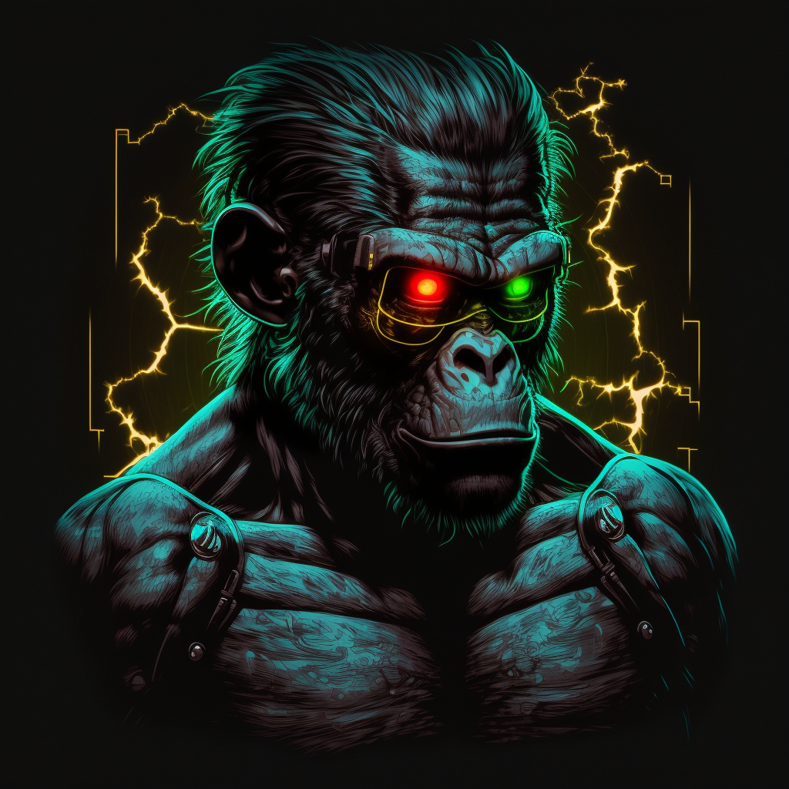
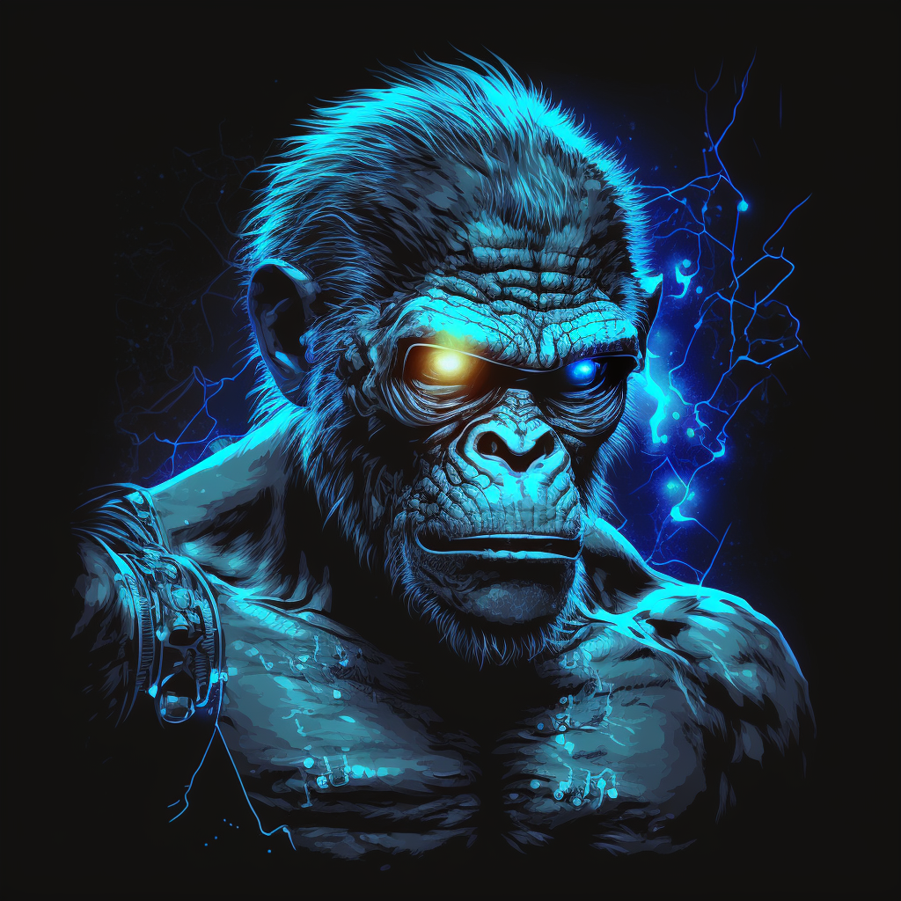
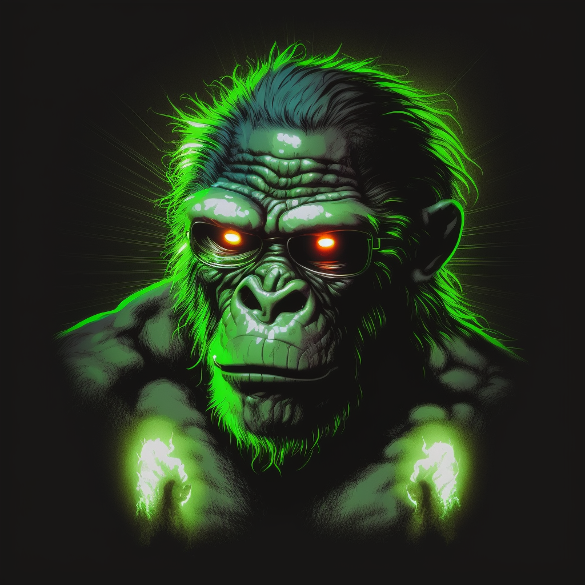
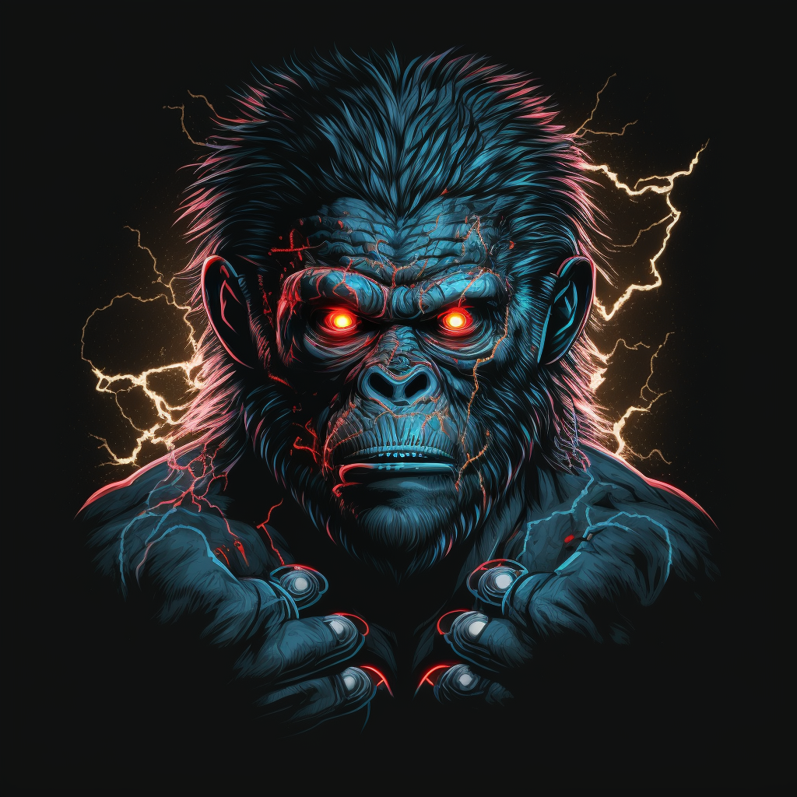

# 👬 Team

The Ordinal BTC team is comprised of a diverse group of cryptocurrency and NFT enthusiasts from different parts of the world.

We recognized the need and opportunity to establish a secure and user-friendly Bitcoin NFT Marketplace on ETH to allow those who do not wish to transact with bitcoin the opportunity to diversify into this market

Our goal is to constantly engage and energize our community, ultimately becoming one of the most rapidly expanding Web3 brands globally.

### Meet the Team



<figure><figcaption>
Howard
</figcaption></figure>



<figure><figcaption>
Will
</figcaption></figure>




<figure><figcaption>
SPIKE
</figcaption></figure>




<figure><figcaption>
PAULY
</figcaption></figure>




<figure><figcaption>
GARY
</figcaption></figure>




<figure><figcaption>
ANDY
</figcaption></figure>


