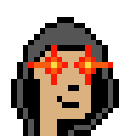

# 👬 Team

The team behind Ordinal BTC is composed of a tight-knit circle of friends who possess a wealth of experience in bitcoin, NFTs, programming, trading, and marketing within the current cryptocurrency market.

We recognized the need and opportunity to establish a secure and user-friendly Bitcoin NFT Marketplace on ETH that would allow for those who don't wish to transact with bitcoin but want to diversify into this market.&#x20;

### Meet the Team



Founder

<figure><figcaption>
HOWARD
</figcaption></figure>



Co-Founder

<figure><figcaption>
WILL
</figcaption></figure>



CTO

<figure><figcaption>
SPIKE
</figcaption></figure>



Community Manager

<figure><figcaption>
GARY
</figcaption></figure>



Head of Marketing

<figure><figcaption>
ANDY
</figcaption></figure>



Lead of Developer

<figure><figcaption>
PAULY
</figcaption></figure>


